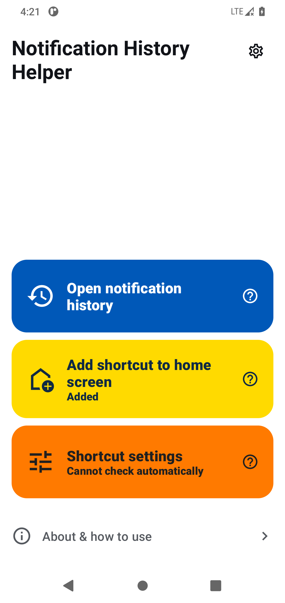
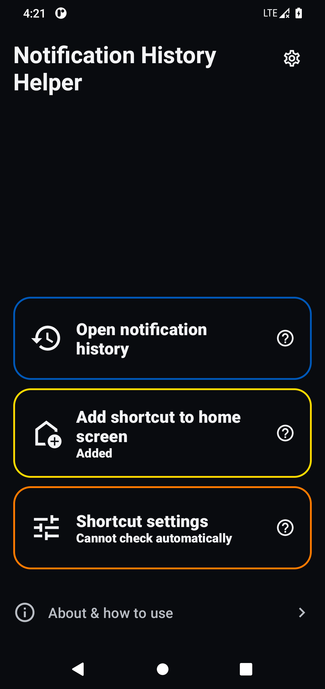

# Notification History Helper

[简体中文](README.zh.md) | [English](README.en.md)

Not everyone needs this app. If your phone already has “Notification history” in Settings, just use the built-in feature. The HyperOS version I use on my Redmi K80 has a clever little trick: the notification history page is still there, but I couldn't find its entry in Settings.

This project started with my experience using a Redmi K80 running HyperOS. I originally wanted to make an app for viewing recalled WeChat and QQ messages. Along the way, I learned that Android already had a notification history feature, but I couldn't find it on my Redmi. I later found that the system page could still be opened. So I made this little tool to open that hidden entry point, plus a home screen shortcut to get there in one tap.

Now I understand why Xiaomi has so many “enthusiasts”: even the entrance to a built-in feature is something users have to build themselves.

Requires Android 11 or later. This app only opens system settings pages. It does not read or store messages, and it does not bypass system restrictions. If a manufacturer has removed the feature or blocked access to it, this app cannot restore it.

## Use cases

- View past notifications from apps, including recalled WeChat and QQ messages.
- Read more of a BOSS Zhipin message without opening the app or marking it as read. The system history may show more text than the normal notification view, although very long messages can still be truncated.

These use cases require the message to have generated a system notification and the record to still exist in system history. This is not a complete chat archive; messages that never generated a notification cannot be recovered.

## Features

- Open system notification history.
- Add a home screen shortcut, check its registration status, and find permission guidance.
- Simplified Chinese and English. By default, the app follows the system's preferred language: Simplified Chinese uses Chinese; all other languages use English.
- Follow system, light mode, and dark mode.
- Separate help buttons for each action, plus an About & how to use page.

## Download and installation

The current version is **[v0.1.4 (pre-release)](https://github.com/Captain-Rainbow-6/notification-history-helper/releases/tag/v0.1.4)**. In Assets, download `notification-history-helper-0.1.4.apk`. Users do not need to compile the app or install Android Studio. While the repository is private, downloads require repository access.

`SHA256SUMS.txt` contains the APK checksum. The optional `verification-materials.zip` attachment provides build materials and checking instructions; it is not needed for installation. The automatically generated Source code archives are for developers, not Android installers.

## Screenshots

 

Actual signed v0.1.4 on an AOSP Android 11 emulator, showing an already registered shortcut. The emulator cannot query Xiaomi's shortcut permission, so it shows “Cannot check automatically”; this does not by itself indicate a failure. Other devices may show different permission states or system pages. No notification content is shown.

## How to use

1. Tap the blue **Open notification history** button.
2. If **Use notification history** is off on the system page, turn it on manually. Recording starts after it is enabled; notifications from the time it was off are not backfilled.
3. Optionally, tap the yellow **Add shortcut to home screen** button. Confirm the home screen prompt if one appears.
4. If no icon appears, tap **Shortcut settings** or the question mark beside a button for help.
5. On Xiaomi / HyperOS, check **Other permissions → Home screen shortcuts → Allow**, then return to this app and try adding the shortcut again. Other systems may use different menus.

System notification history usually keeps the most recent 24 hours of notifications; the exact behavior depends on your phone. Turning off **Use notification history** may clear saved records. Turning it back on does not restore cleared records.

The system's history recording switch and the manufacturer's shortcut permission are separate settings. You do not need to grant this app notification access, overlay permission, or background pop-up permission. Normal use does not require a computer, developer mode, or ADB.

## Privacy and limitations

- Android stores the notifications. This app does not read, store, or upload messages, has no network access, and includes no advertising or analytics SDKs.
- It does not modify WeChat, QQ, or other apps, and does not use root, hooking, or an accessibility service.
- Only content delivered as a system notification and retained in system history can be viewed. Messages without notifications, hidden content, and expired records cannot be recovered.
- It can help you view messages that previously appeared as notifications, such as recalled messages or mentions. It cannot guarantee that every message is recorded, and it does not prevent message recall.
- It only attempts to open system pages it is permitted to access. It does not request extra permissions to bypass access restrictions.
- Shortcut support, confirmation prompts, and icon placement are controlled by your phone's system and home screen.
- Xiaomi / HyperOS permission detection is an optional manufacturer-specific compatibility query for this app's own permission. The interface may change with system updates. An unknown result is not treated as either allowed or denied.
- **Added** reflects Android's shortcut registration, not a guarantee of an icon's location on the current home screen. If you cannot find the icon, you can explicitly choose to add it again.

## Compatibility

The signed v0.1.4 APK has undergone basic checks on an AOSP Android 11 emulator and a Redmi K80 running Android 16 / HyperOS OS3.0.307.0.WOKCNXM. On the physical device, checks covered startup, opening system history and shortcut settings, and displaying, dismissing, and resetting the help notice. The maintainer also manually confirmed shortcut creation, the success notification, and opening history from the shortcut. These checks do not guarantee compatibility with every manufacturer or home screen.

Earlier automated UI tests failed intermittently and passed on reruns; the root cause remains unconfirmed. The later basic and manual checks do not establish that this testing issue is resolved.

## Building from source (developers)

If you want to compile the app or work on the project, see the [build and test guide (Chinese)](docs/BUILDING.md). Users who only want to download and use the app can skip this section.

## Distribution and licensing

This project is published by **Captain Rainbow** as an individual. Official signed pre-release APKs are provided through the project's Releases page.

The project uses a custom [source-available license](LICENSE) that **restricts commercial use and is not an OSI-approved open-source license**. The points below are a summary, not a replacement for the license and branding statement, which are currently in Chinese:

- Free personal use, study, and noncommercial modification are allowed. Businesses, organizations, and their employees may use the official unmodified app internally for free.
- Sharing official project and download links is allowed. Free redistribution of an official unmodified APK must preserve the file and signature, identify the app, version, and official source, and must not involve charging, bundling, or impersonation.
- Distributed modified versions must provide the complete corresponding project source and build instructions, credit the source and explain the changes, retain the project's license conditions, and use a different app name, app icon, and any shortcut icon containing official branding.
- Charging, in-app advertising, commercial integration, and redistributing APKs on download pages displaying advertisements require prior explicit written permission. Merely sharing an official link is not prohibited just because a social platform displays ordinary advertisements.
- Listed app and shortcut artwork is also covered by the [branding and artwork statement](docs/BRANDING.md). Official unmodified APKs keep their icons; this does not grant permission to use those icons as another product's branding.

The custom license was drafted for this project's distribution requirements and has not been reviewed by a lawyer. It does not guarantee ownership of every material or the enforceability of every provision.

The Google Material Icons used in the interface are licensed under Apache License 2.0. See the [third-party icon notice](app/src/main/assets/material_icons_license.txt) for attribution and the full license; it is also available offline in the app's About page. Third-party components retain their own licenses. The icon license does not make this entire project Apache-2.0 licensed.
