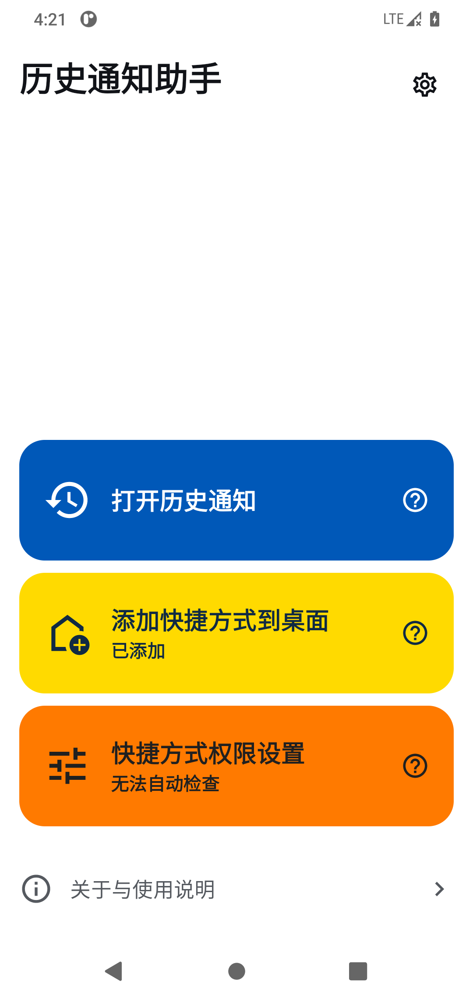
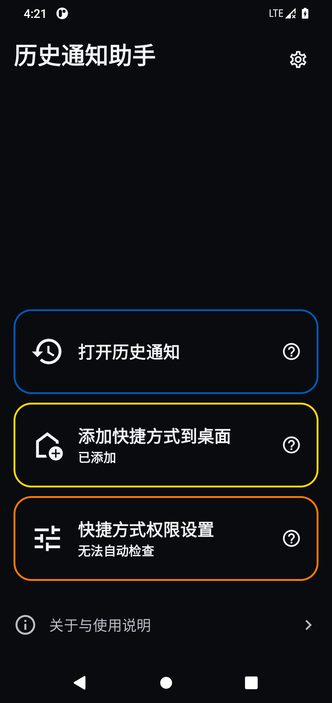

# 历史通知助手 / Notification History Helper

[简体中文](README.zh.md) | [English](README.en.md)

不是每个人都需要这个 App，如果你的手机设置里已经有“历史通知”，直接使用系统自带的功能就好。我使用的 Redmi K80／HyperOS 版本就很有“小巧思”：历史通知的系统页面还在，设置里却找不到入口。

这个项目起于我使用 Redmi K80／HyperOS 的经历：我本来想做一个支持微信QQ查看撤回消息的APP，期间发现Android有历史通知功能，但是我的Android红米手机设置里却找不到这个功能的入口，后来发现对应的系统页面仍能打开，于是做了这个小工具，打开这个隐藏的入口，再加一个一键直达的桌面快捷方式。

这下知道为什么小米有这么多发烧友了：系统自带的功能，入口还得用户自己补。

该软件适用于 Android 11 及以上系统。本 App 只负责打开系统页面，不读取或保存消息，也不绕过系统限制。如果厂商已经移除该功能或禁止访问，本 App 也无法恢复它。

## 使用场景

- 可以查看各种 App 的历史消息通知，包括微信、QQ 被撤回的消息。
- 可以不用点进 BOSS 直聘就能看到更完整一点的信息（比正常查看系统通知完整，但是消息过长还是显示不全），不用显示“已读”。

以上场景以消息已经产生系统通知、且记录仍保存在系统历史中为前提。这里不是完整聊天记录；未产生通知的消息无法恢复。

## 功能

- 打开系统历史通知。
- 添加桌面快捷方式，查看添加状态并提供权限指引。
- 简体中文与 English；默认跟随系统首选语言，其他语言使用英文。
- 跟随系统、白天模式与黑夜模式。
- 每个按钮提供独立帮助，关于页面提供使用说明。

## 下载与安装

当前版本为 **[v0.1.4（预发布）](https://github.com/Captain-Rainbow-6/notification-history-helper/releases/tag/v0.1.4)**。在 Assets（附件）中下载 `notification-history-helper-0.1.4.apk`。普通用户无需自行编译，也无需安装 Android Studio。仓库处于私有状态时，下载需要仓库访问权限。

`SHA256SUMS.txt` 提供安装包校验值；可选的 `verification-materials.zip` 附件提供构建材料和核验方法，安装 App 不需要下载。自动生成的 Source code 压缩包是面向开发者的源码，不是手机安装包。

## 界面预览

 

截图为正式签名 v0.1.4 在 AOSP Android 11 模拟器上的实际界面，已登记桌面快捷方式。模拟器无法查询小米的快捷方式权限，因此显示“无法自动检查”；这本身不代表操作失败。其他设备的权限状态和系统页面可能不同。截图不含通知内容。

## 使用方法

1. 点击蓝色的“打开历史通知”。
2. 如果系统页面中的“使用历史通知”尚未开启，请手动开启。记录从开启后开始；不会补回关闭期间的通知。
3. 可选：点击黄色的“添加快捷方式到桌面”。如桌面弹出确认窗口，请自行确认。
4. 没有出现图标时，点击“快捷方式权限设置”或按钮旁的问号查看帮助。
5. 小米／HyperOS 可检查“其他权限 → 桌面快捷方式 → 允许”（Other permissions → Home screen shortcuts），返回 App 后重新添加。其他系统的菜单可能不同。

系统历史通知通常保留最近 24 小时的通知，具体以手机系统为准。关闭系统的“使用历史通知”可能清空已保存的记录；重新开启不会恢复被清空的内容。

系统记录开关与厂商的桌面快捷方式权限是两件不同的事。无需授予本 App 通知使用权、悬浮窗或后台弹窗权限，也无需连接电脑、启用开发者模式或使用 ADB。

## 隐私与能力边界

- 通知由 Android 保存。本 App 不读取、保存或上传消息，不联网，不含广告或统计 SDK。
- 不修改微信、QQ 等应用，不使用 Root、Hook 或无障碍服务。
- 只有已经发送到系统通知、并被系统历史保存的内容才可能查看。未产生通知、内容被隐藏或记录已过期的消息无法恢复。
- 可用于查看曾出现在系统通知中的消息，例如已被撤回的消息或提及提醒；不能保证记录所有消息，也不阻止撤回。
- 只尝试打开本 App 有权访问的系统页面；不支持时不会申请额外权限来绕过限制。
- 桌面快捷方式是否受支持、是否出现确认窗口，以及图标位置，由手机系统和桌面决定。
- 小米／HyperOS 的权限读取为可选的厂商兼容查询，仅查询本 App。接口可能随系统更新变化；无法查询时不会把未知状态当成已允许或已拒绝。
- “已添加”基于 Android 的快捷方式登记，不保证图标在当前桌面的具体位置；找不到时可以主动重新添加。

## 兼容性

正式签名 v0.1.4 已在 AOSP Android 11 模拟器及 Redmi K80（Android 16 / HyperOS OS3.0.307.0.WOKCNXM）完成基础检查。真机检查包括启动、打开系统历史通知与快捷方式设置，以及提示框的显示、关闭和重新打开后的重置；维护者另行手动确认了快捷方式创建、成功提示及通过快捷方式打开历史通知。这些检查不代表所有厂商或桌面均可使用。

此前自动化界面测试曾出现复测通过的偶发失败，根因尚未完全确认；后续基础检查和手动测试通过，不代表该测试问题已经解决。

## 从源码构建（开发者）

如果你想自行编译或参与开发，请查看[构建与测试说明](docs/BUILDING.md)。仅下载安装使用的用户可以跳过这一部分。

## 发布与许可

本项目由 **Captain Rainbow** 以个人名义发布；正式签名的预发布安装包通过本项目 Releases 页面提供。

项目采用自定义的[源码可见许可](LICENSE)，**限制商业使用，不属于 OSI 定义的开源许可**。主要规则如下，具体以许可全文及品牌声明为准：

- 允许个人免费使用、学习和非商业修改；允许企业、机构及其员工在内部免费使用官方原版。
- 允许分享官方项目及下载链接。免费转发官方原版 APK 时，须保持文件与签名不变，注明名称、版本和官方来源，不收费、不捆绑、不冒充官方。
- 免费发布修改版须提供对应的完整项目源码和构建说明，注明来源与修改，继续遵守项目许可，并更换应用名称、应用图标及含官方标志的快捷方式图标。
- 收费、App 内广告、商业整合，以及通过带广告的下载页面重新分发 APK，均须事先获得明确书面授权。单纯分享官方链接，不因社交平台展示普通广告而被禁止。
- 应用与快捷方式图标等列明资源另按[品牌与美术资源声明](docs/BRANDING.md)使用；原版转发可保留图标，不得据此将其用于其他产品的品牌标识。

这是按项目发布要求拟定的自定义许可文本，未经律师审查；不代表已对所有材料的权属或条款的法律效力作出保证。

界面使用的 Google Material Icons 遵循 Apache License 2.0，来源和许可全文见 [第三方图标声明](app/src/main/assets/material_icons_license.txt)，也可在 App 关于页面离线查看。第三方组件继续遵循各自许可；该图标许可不代表整个项目采用 Apache License 2.0。
